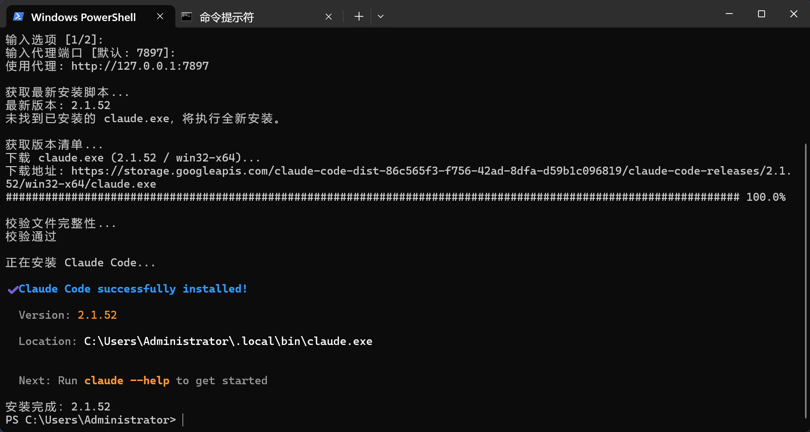

# cc-download

> Download, install & update [Claude Code](https://docs.anthropic.com/en/docs/claude-code) with proxy support and progress bar — on Windows, Linux and macOS.

在 Windows / Linux / macOS 上安装和更新 Claude Code，支持代理、显示下载进度，并支持下载离线安装包安装到无网络的服务器。

## Quick Start

**Windows**（PowerShell）：

```powershell
irm https://raw.githubusercontent.com/ipfred/cc-download/master/cc_download.ps1 | iex
```

**Linux / macOS**（bash）：

```bash
curl -fsSL https://raw.githubusercontent.com/ipfred/cc-download/master/cc_download.sh | bash
```

脚本会引导你完成代理配置、下载、校验、安装的全部流程。



## Pain Points / 解决了什么问题

- Claude Code 不支持 npm 方式下载更新，官方脚本在 Windows 上只能开 tun 模式使用
- 官方脚本更新没有进度且下载很慢，每次不知道是卡死了还是在下载
- 没有公网的服务器上无法直接安装，官方没有离线下载安装包的方式

| | 官方脚本 | cc-download |
|---|---|---|
| **平台** | Windows / Linux / macOS 各一套 | 统一体验，ps1 + sh 覆盖全平台 |
| **代理** | 设了环境变量也不一定生效 | 交互式配置，curl `--proxy` 直连生效 |
| **进度** | 没有任何输出，不知道卡没卡 | curl 进度条，实时显示速度和进度 |
| **离线** | 不支持 | 下载任意平台安装包，上传服务器离线安装 |
| **校验** | 无 | SHA256 校验，确保文件完整 |

## Usage

### 运行方式

```
cc_download[.ps1|.sh]               # 启动后交互选择模式：download / install / update
                                    # install 模式可继续选择 target：默认 / latest / stable / 指定版本
```

---

### Windows

**一行命令（推荐）：**

```powershell
# 运行后交互选择模式（download / install / update）
irm https://raw.githubusercontent.com/ipfred/cc-download/master/cc_download.ps1 | iex

# 本地脚本同样是交互选择模式
.\cc_download.ps1
```

**手动下载脚本后运行：**

```powershell
# 运行后选择模式与目标
.\cc_download.ps1
```

---

### Linux / macOS

```bash
# 运行后交互选择模式与目标
bash cc_download.sh
```

---

### 交互流程示例

**统一入口（先选模式）：**

```
选择运行模式：
  1) download  下载离线安装包（默认）
  2) install   安装 Claude Code
  3) update    更新 Claude Code

输入选项 [1/2/3]: 2

选择安装目标：
  1) 默认（不指定 Target，默认通道）
  2) latest
  3) stable
  4) 指定版本号（如 1.0.33）

输入选项 [1/2/3/4]: 3

请选择代理类型：
  1) HTTP 代理（默认）
  2) 不使用代理

输入选项 [1/2]: 1
输入代理端口 [默认: 7897]: 7897
使用代理: http://127.0.0.1:7897

最新版本: 1.0.33
当前版本: 1.0.32
需要更新: 1.0.32 -> 1.0.33

下载 claude (1.0.33 / linux-x64)...
######################################## 100.0%
校验通过
更新完成：1.0.32 -> 1.0.33

✅ 完成！
```

**下载模式（在模式选择中选 download）：**

```
选择目标平台：
  1) linux-x64          Linux x64 (glibc)
  2) linux-arm64        Linux ARM64 (glibc)
  3) linux-x64-musl     Linux x64 (musl/Alpine)
  4) linux-arm64-musl   Linux ARM64 (musl/Alpine)
  5) darwin-x64         macOS x64 (Intel)
  6) darwin-arm64       macOS ARM64 (Apple Silicon)
  7) win32-x64          Windows x64
  8) win32-arm64        Windows ARM64

```

## Requirements

**Windows：**
- Windows 10/11（64 位）
- PowerShell 5.1+
- curl.exe（Windows 10 1803+ 自带）

**Linux / macOS：**
- bash
- curl 或 wget

## FAQ

<details>
<summary><b>Windows 遇到执行策略限制怎么办？</b></summary>

```powershell
powershell -ExecutionPolicy Bypass -File .\cc_download.ps1
```

</details>

<details>
<summary><b>代理端口填什么？</b></summary>

填写你本地代理客户端的 HTTP 端口：

| 客户端 | 默认端口 |
|--------|---------|
| Clash Verge | 7897 |
| v2rayN | 10809 |
| Shadowsocks | 1080 |

</details>

<details>
<summary><b>安装后找不到 claude 命令？</b></summary>

如果脚本回退到复制安装，需要手动将目录加入 PATH。

**Windows：**
```powershell
[Environment]::SetEnvironmentVariable('PATH', $env:PATH + ';' + "$env:USERPROFILE\.local\bin", 'User')
```

**Linux / macOS：**
```bash
echo 'export PATH="$PATH:$HOME/.local/bin"' >> ~/.bashrc
source ~/.bashrc
```

重新打开终端生效。

</details>

<details>
<summary><b>如何查看目标机器的平台？</b></summary>

在目标机器上运行以下命令，对照结果选择对应平台。

**Windows（PowerShell）：**

```powershell
$env:PROCESSOR_ARCHITECTURE
```

| 输出 | 选择平台 |
|------|---------|
| `AMD64` | `win32-x64` |
| `ARM64` | `win32-arm64` |

---

**Linux：**

```bash
# 第一步：查看 CPU 架构
uname -m

# 第二步：判断是否为 musl 系统（Alpine 等）
ldd /bin/ls 2>&1 | grep -q musl && echo "musl" || echo "glibc"
```

| `uname -m` | libc | 选择平台 |
|-----------|------|---------|
| `x86_64` | glibc | `linux-x64` |
| `aarch64` | glibc | `linux-arm64` |
| `x86_64` | musl | `linux-x64-musl` |
| `aarch64` | musl | `linux-arm64-musl` |

---

**macOS：**

```bash
# 第一步：查看 CPU 架构
uname -m

# 第二步：如果第一步输出 x86_64，检查是否在 Rosetta 2 下运行
sysctl -n sysctl.proc_translated 2>/dev/null
```

| `uname -m` | `proc_translated` | 选择平台 |
|-----------|-------------------|---------|
| `arm64` | — | `darwin-arm64` |
| `x86_64` | 空 / `0` | `darwin-x64` |
| `x86_64` | `1`（Rosetta） | `darwin-arm64` |

> Apple Silicon Mac 上用 Rosetta 启动的终端会显示 `x86_64`，但实际应下载 `darwin-arm64`。

</details>

<details>
<summary><b>如何在无网络的服务器上安装？</b></summary>

1. 在有网络的机器上运行脚本，选择 `download` 模式后再选择目标服务器的平台和版本
2. 将下载好的文件上传到服务器
3. 在服务器上执行：

```bash
chmod +x /tmp/claude-1.0.33-linux-x64
/tmp/claude-1.0.33-linux-x64 install
```

</details>

## How It Works

```
获取 install.ps1 / install.sh → 解析 GCS 存储桶地址
              ↓
        交互选择模式（download / install / update）
              ↓
        ┌─────┴─────────┐
     download        install / update
        ↓                 ↓
  选择目标平台         查询最新版本号
  选择版本通道             ↓
      查询版本号      检测本地已安装版本
        ↓            已是最新？→ 退出
        └─────┬─────────┘
              ↓
     下载 manifest.json → 提取 SHA256
              ↓
      curl 下载二进制（带进度条）
              ↓
          SHA256 校验
              ↓
     ┌────────┴────────┐
  下载模式          install / update
  存到当前目录      install → 执行 binary install（可选 target）
  打印离线指引      update  → 替换已安装文件
```

## License

MIT

## Star History

如果这个脚本帮到了你，欢迎点个 Star 支持一下。
